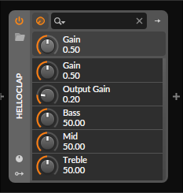

# CLAP amp plugin

This plugin attempts to emulate a fender style tone stack with high amounts of
distortion. Other tone stacks can be implemented by modifying the filters being
used in render_audio.

Only supports the Clap C api.

Clap entrypoint and related metadata is in src/main.zig and the plugin
function pointers are located in src/plugin.zig.



## Building and Installing

To build, you need to install the Zig compiler and checkout this repository
and it's submodules.

### Linux

Navigate to the project root, and run the following
```
zig build
cp zig-out/lib/libvst.so ~/.clap/guitar_plugin.clap
```

### Windows/Mac

I haven't officially tested on windows and mac, however the process should
be the same as Linux
1. Setup [zig dev env](https://ziglang.org/learn/getting-started/)
2. Run `zig build` in project
3. Move zig-out/lib/libvst.(so/dll) into the clap plugin directory as a .clap file
    - Windows `%LOCALAPPDATA%\Programs\Common\CLAP\guitar_plugin.clap`
    - Mac `~/Library/Audio/Plug-ins/CLAP/guitar_plugin.clap`

## References

Used the TSC as a reference for filter params: 
[Tone Stack Calculator](http://www.guitarscience.net/tsc/info.htm)

Ported cubic nonlinear distortion from the faust implementation: 
[FAUST](https://faustlibraries.grame.fr/libs/misceffects/#efcubicnl)

Ported filter equations from CALF's implementation: 
[CALF](https://github.com/calf-studio-gear/calf/blob/master/src/calf/biquad.h)

See the
[EQ Cookbook](https://webaudio.github.io/Audio-EQ-Cookbook/audio-eq-cookbook.html)
for more info on these equations.
